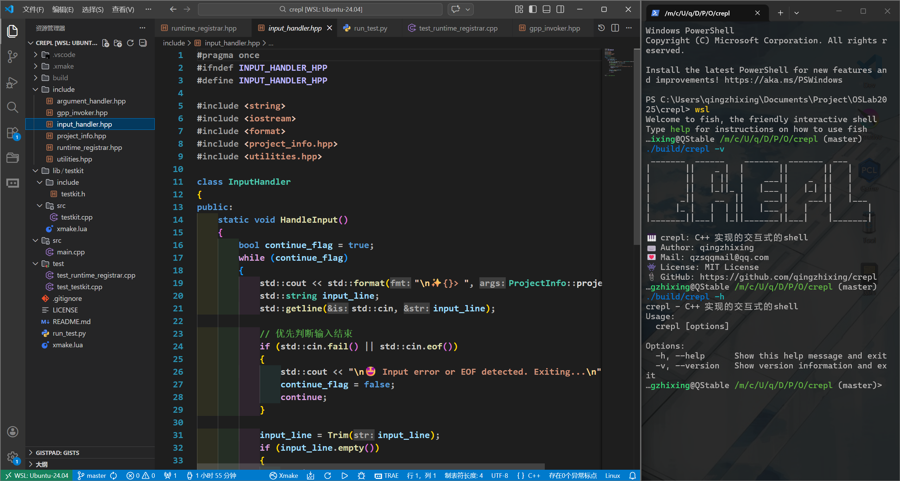
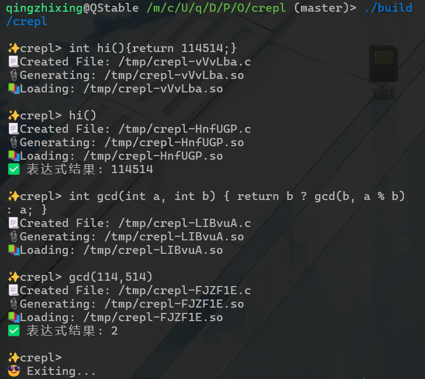

# 🎹M4: C Read-Eval-Print-Loop (crepl)

## ✨ 项目介绍

* 一个基于 C/C++ 语言的交互式shell, 支持函数/表达式的注册和调用.

> More Info: [https://jyywiki.cn/OS/2025/labs/M4.md](https://jyywiki.cn/OS/2025/labs/M4.md)



## 💖 展示



## 🥞 编译运行

* 本项目基于xmake构建
* 请确保你的环境中有 `gcc`命令
* 请确保在项目根目录下执行命令

``` bash
xmake
./build/crepl
```

## 🔧 运行测试

* 请确保你的环境中有 `python3` 以及相关的库
* 请确保在项目根目录下执行命令

``` bash
./run_test.py
```
